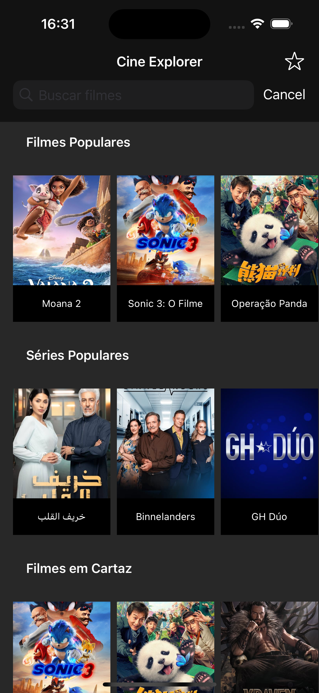

# My iOS Developer Portfolio

## About Me

My name is Filipe and I am a Senior iOS Developer with over 10 years of experience, specializing in Swift, iOS architectures like Viper, Clean Swift and Coordinator patterns, and CI/CD.

## Projects in Focus

Here are some of my featured projects that showcase my skills and experience in iOS development.

### Cine Explorer

Cine Explorer is an iOS application designed for movie and series enthusiasts.  It provides an intuitive interface to discover new films and series, view detailed information, watch trailers, and manage favorites.  The app leverages the TMDB API to provide a rich catalog of content.  It's built using MVVM-C architecture, Combine for asynchronous operations, and features comprehensive unit and snapshot testing.

**Key Features:**

*   Browse and search for movies and series.
*   View detailed information including synopsis, cast, and ratings.
*   Discover related movies and series.
*   Watch trailers.
*   Manage a list of favorite movies and series.

**Technologies Used:**

*   Swift
*   MVVM-C (Model-View-ViewModel-Coordinator)
*   Combine
*   URLSession
*   SDWebImage
*   XCTest
*   SnapshotTesting
*   CocoaPods

[View on GitHub](https://github.com/filipexavierfernandes/Cine-Explorer)

## Future Projects

I'm currently planning and developing new projects to further enhance my portfolio.

### TaskFlow

TaskFlow is a mobile task manager app designed to showcase my proficiency in iOS development, using architectures such as VIPER, Clean Swift, and MVVM-C. The app is being built with SwiftUI and Combine for a modern and reactive UI, ensuring a smooth and efficient experience for users.  This project is currently in development.

## Contact

*   **Email**: xf_filipe@hotmail.com
*   [LinkedIn](https://www.linkedin.com/in/filipe-xavier-fernandes/)